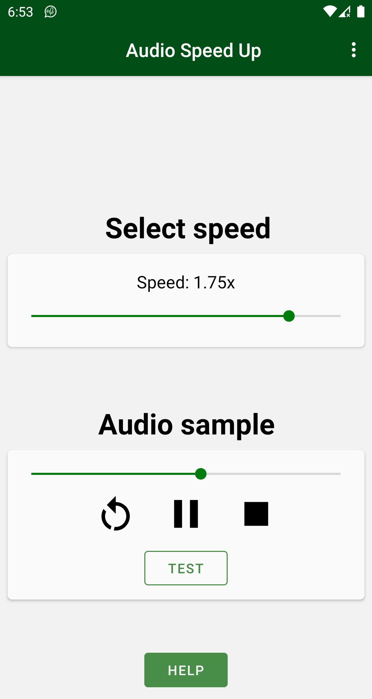
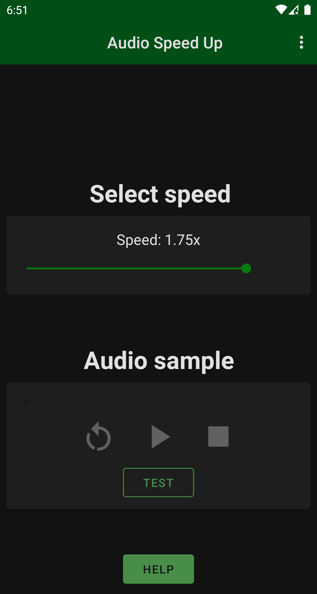
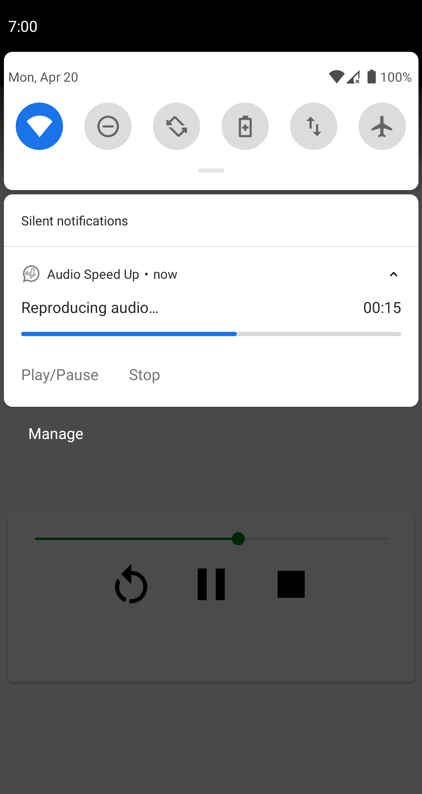
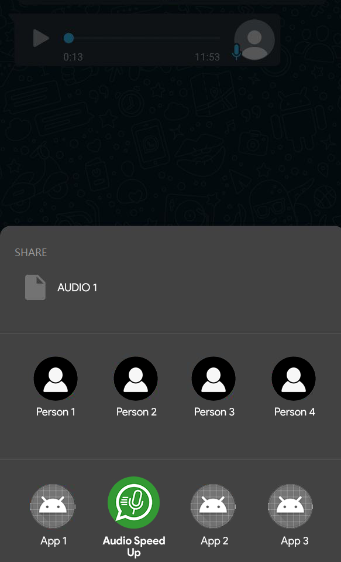

# AudioSpeedUp 

 <b><i> !! Now hidden from PlayStore !!</i></b></p

**	 **

### [**Direct Download**](https://github.com/bonsky97/AudioSpeedUp/releases/latest/download/AudioSpeedUp-GitHub.apk)
**NOTE: Supported on Andoird 7.1 or newer**

*AudioSpeedUp* is the open source app for Android for reproducing at different speed your audio files. Select a sound to play, such as WhatsApp voice notes, and select *AudioSpeedUp* from the share button. This app has been developed with non-profit intent by [Lorenzo D'Auria](https://github.com/lodauria) on an idea of [Davide Puato](https://www.youtube.com/c/stockdroid) for helping people who are to busy for listening to slow voice notes.

_**For Italian users**: This project has been presented also in a [YouTube video](https://youtu.be/IKIYfGBtt2g)._

## Screenshots

    

## Features

  - Opus files supported
  - Proximity sensor detection
  - Multiple languages available

  - Dark theme available
  - Control the music player from notification bar
  - Switch applications during reproduction
  - Donate using the donate button

## Donations

Donations are always welcome, you can use this [link](https://paypal.me/AudioSpeedUp). Thank you in advise!

## Contributions

A big thanks for the spontaneous contribution of:

 - [Massimiliano Montaleone](https://github.com/Fast0n)
 - [Massimo Pagani](https://github.com/massimopagani)
 - [Matteo Gheza](https://github.com/MatteoGheza)

License
----
MIT

_See [here](https://github.com/bonsky97/AudioSpeedUp/blob/master/LICENSE) for details._
